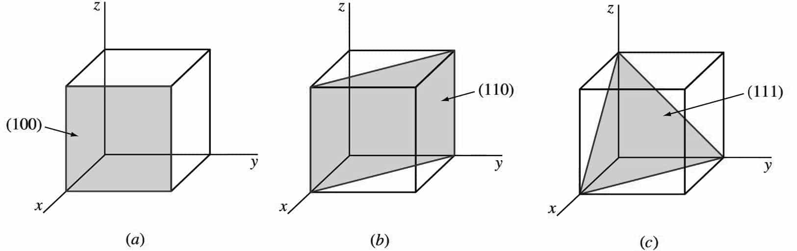

## Miller Indices
Miller indices give a sense of direction and help specify planes in a lattice. A lattice in N dimensions has N indices and in the case of a 3D lattice, it is represented by the letters h,k and l. These indices can be used to specify a "Miller plane", a plane that intercepts the three points $a_{1}/h$, $a_{2}/k$ and $a_{3}/l$ or any multiple thereof where $a_{1}$, $a_{2}$ and $a_{3}$ denote the primitive vectors of the given lattice. In simpler words, the indices are proportional to the inverse of the intercepts of the plane. An example of Miller indices and their corresponding planes is given below

  

A zero index denotes that the intercept is at infinity, essentially meaning the plane is parallel to that primitive vector.

### Obtaining Miller indices from a given plane
Given a plane and its equation, it is fairly straight forward to find its intercepts on the vectors. If these intercepts are integers with no common divisor, then those intercepts in order are the Miller indices. If there is a common divisor however, those numbers need to be divided by that divisor and then can be used as the indices. If the intercepts are fractional however, it is required that a lowest common multiple of the denominators is found and all the numbers multiplied by it. This way, it is possible to determine the Miller indices of a plane given its equation or its intercepts.
